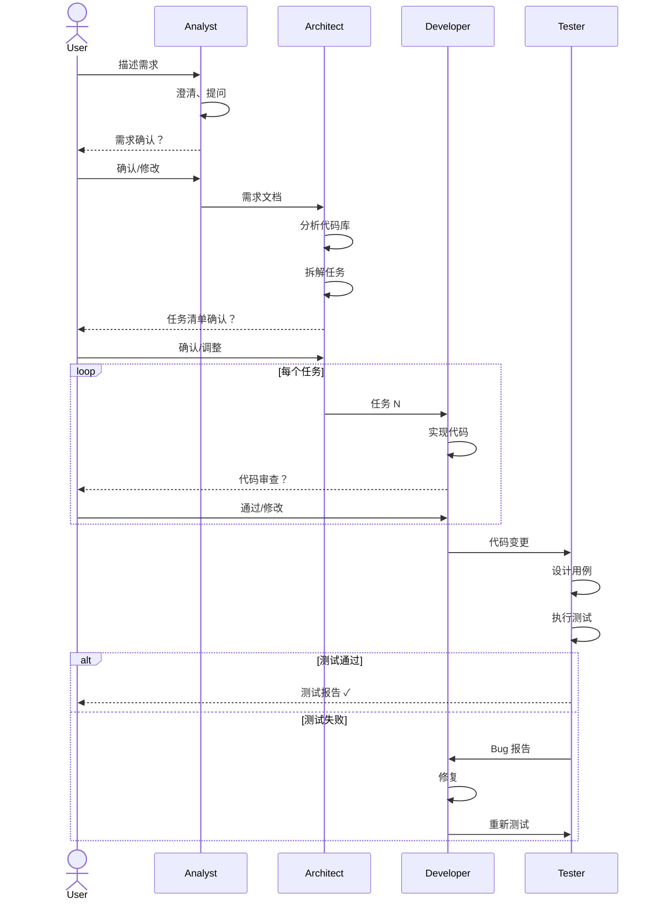

# 多角色协作系统设计

> 目标：构建一套 AI 角色协作流水线，覆盖从需求分析到测试验收的完整软件开发周期，实现「人机协作」与「机机协作」的无缝衔接。

## 0. 核心概念：Runner + Agent

系统采用 **Runner + Agent** 的分层架构：

```
┌─────────────────┐     驱动      ┌─────────────────┐
│     Runner      │ ────────────▶ │     Agent       │
│  (Claude Code)  │               │ (需求分析 Agent) │
│  (Codex)        │               │ (架构 Agent)     │
│  (Kimi CLI)     │               │ (开发 Agent)     │
└─────────────────┘               └─────────────────┘
     技术层                              业务层
   「怎么执行」                        「代表谁行事」
```

### Runner（执行器）

Runner 是底层 AI 执行器，负责实际调用 CLI 工具：

- `codex` - OpenAI Codex CLI
- `claude-code` - Claude Code CLI
- `claude-code-glm` - Claude Code + 智谱 GLM
- `claude-code-kimi` - Claude Code + Kimi
- `kimi-cli` - Kimi CLI

**代码位置**: `src/shared/runners.ts`, `src/main/runners/`

### Agent（助手）

Agent 是用户可配置的 AI 助手，定义职责和行为：

| 属性 | 说明 |
|------|------|
| `id` | 唯一标识 |
| `name` | 显示名称 |
| `systemPrompt` | 定义 Agent 行为的指令 |
| `capabilities` | 允许的能力（读写文件、执行命令等） |
| `defaultRunner` | 默认使用的 Runner |

**预设 Agent**:
- `general` - 通用助手
- `analyst` - 需求分析 Agent
- `architect` - 架构 Agent
- `developer` - 开发 Agent
- `tester` - 测试 Agent

**代码位置**: `src/shared/agents.ts`

### 运行时组合

```typescript
// Runner 扮演 Agent 执行任务
const runner: Runner = 'claude-code'
const agent = getPresetAgent('developer')
const prompt = buildAgentPrompt(agent, userInput)
await runnersBridge.run({ runner, prompt })
```

---

## 1. 设计背景与目标

### 1.1 问题

单一 AI Agent 在处理复杂软件开发任务时存在以下挑战：

- **上下文膨胀**：需求、设计、代码、测试堆积在一个对话中，容易丢失关键信息
- **角色混乱**：同时扮演分析师、架构师、开发者、测试者，缺乏明确的职责边界
- **质量失控**：没有检查点和交接机制，错误容易向下游传递
- **难以回溯**：出问题时难以定位是哪个阶段引入的

### 1.2 目标

- **职责分离**：每个角色有明确的输入、输出和职责边界
- **流水线化**：角色之间通过结构化产物交接，形成可追溯的工作流
- **质量门禁**：每个阶段有验收标准，不合格不流转
- **人机协同**：用户可在任意节点介入审核、修改或跳过

## 2. 角色定义

```
┌─────────────────────────────────────────────────────────────────────────────┐
│                           Multi-Role Pipeline                                │
├─────────────────────────────────────────────────────────────────────────────┤
│                                                                             │
│   ┌─────────┐    ┌─────────┐    ┌─────────┐    ┌─────────┐    ┌─────────┐  │
│   │  User   │───▶│Analyst  │───▶│Architect│───▶│Developer│───▶│ Tester  │  │
│   │(需求方) │    │(需求师) │    │(架构师) │    │(开发者) │    │(测试员) │  │
│   └─────────┘    └─────────┘    └─────────┘    └─────────┘    └─────────┘  │
│        │              │              │              │              │        │
│        │              ▼              ▼              ▼              ▼        │
│        │         [需求文档]    [任务清单]      [代码变更]     [测试报告]   │
│        │                                                          │        │
│        └──────────────────────────────────────────────────────────┘        │
│                            反馈循环                                          │
└─────────────────────────────────────────────────────────────────────────────┘
```

### 2.1 需求分析师（Analyst）

**职责**：理解用户意图，输出结构化需求

| 属性 | 说明 |
|------|------|
| 输入 | 用户的自然语言描述、截图、参考资料 |
| 输出 | 结构化需求文档（Requirement Spec） |
| 核心能力 | 需求澄清、边界识别、用例提取 |
| 验收标准 | 需求完整、无歧义、可测试 |

**输出模板**：

```yaml
requirement:
  id: REQ-001
  title: "用户登录功能"
  description: |
    用户可以通过邮箱/密码登录系统
  
  user_stories:
    - as: 注册用户
      want: 使用邮箱密码登录
      so_that: 访问我的个人数据
  
  acceptance_criteria:
    - 输入正确凭证后跳转首页
    - 输入错误凭证显示错误提示
    - 连续失败 5 次锁定账户 15 分钟
  
  constraints:
    - 密码不得明文存储
    - 登录响应时间 < 2s
  
  out_of_scope:
    - 第三方 OAuth 登录（下期）
    - 双因素认证（下期）
```

### 2.2 架构师（Architect）

**职责**：将需求拆解为可执行任务，确定技术方案

| 属性 | 说明 |
|------|------|
| 输入 | 需求文档 + 现有代码库上下文 |
| 输出 | 任务清单（Task List）+ 技术方案 |
| 核心能力 | 代码库理解、任务分解、依赖分析、风险评估 |
| 验收标准 | 任务可独立执行、估时合理、无遗漏 |

**输出模板**：

```yaml
task_breakdown:
  requirement_ref: REQ-001
  tech_approach: |
    使用 bcrypt 加密密码，JWT 管理会话，
    Redis 存储登录失败计数
  
  tasks:
    - id: TASK-001-1
      title: "添加 User 模型字段"
      description: "在 User 表增加 passwordHash、loginAttempts、lockedUntil"
      files:
        - src/models/user.ts
        - prisma/schema.prisma
      estimate: 30min
      priority: 1
      dependencies: []
      
    - id: TASK-001-2
      title: "实现密码加密服务"
      description: "创建 PasswordService，包含 hash/verify 方法"
      files:
        - src/services/password.ts (new)
      estimate: 45min
      priority: 1
      dependencies: []
      
    - id: TASK-001-3
      title: "实现登录 API"
      description: "POST /api/auth/login 端点"
      files:
        - src/api/auth/login.ts (new)
        - src/api/auth/index.ts
      estimate: 1h
      priority: 2
      dependencies: [TASK-001-1, TASK-001-2]
      
    - id: TASK-001-4
      title: "实现账户锁定逻辑"
      description: "登录失败计数与锁定机制"
      files:
        - src/services/auth.ts
      estimate: 45min
      priority: 2
      dependencies: [TASK-001-3]
  
  risks:
    - description: "并发登录可能导致计数不准"
      mitigation: "使用 Redis INCR 原子操作"
```

### 2.3 开发者（Developer）

**职责**：按照任务清单实现代码

| 属性 | 说明 |
|------|------|
| 输入 | 单个任务项 + 相关文件上下文 |
| 输出 | 代码变更（Code Changes） |
| 核心能力 | 代码编写、重构、遵循规范 |
| 验收标准 | 代码可运行、符合规范、通过 lint |

**行为约束**：

- 严格按照任务描述实现，不擅自扩展范围
- 遵循项目现有代码风格和架构模式
- 每个任务产出可独立提交的变更
- 复杂变更需附带实现说明

### 2.4 测试工程师（Tester）

**职责**：验证实现是否满足需求

| 属性 | 说明 |
|------|------|
| 输入 | 需求文档 + 代码变更 + 运行环境 |
| 输出 | 测试报告（Test Report） |
| 核心能力 | 用例设计、边界测试、回归验证 |
| 验收标准 | 所有验收条件覆盖、无阻塞性 Bug |

**输出模板**：

```yaml
test_report:
  requirement_ref: REQ-001
  
  test_cases:
    - id: TC-001
      title: "正常登录"
      steps:
        - 输入有效邮箱和密码
        - 点击登录
      expected: 跳转到首页，显示用户名
      actual: 符合预期
      status: PASS
      
    - id: TC-002
      title: "错误密码"
      steps:
        - 输入有效邮箱和错误密码
        - 点击登录
      expected: 显示"邮箱或密码错误"
      actual: 符合预期
      status: PASS
      
    - id: TC-003
      title: "账户锁定"
      steps:
        - 连续 5 次输入错误密码
        - 第 6 次尝试登录
      expected: 显示"账户已锁定，请 15 分钟后重试"
      actual: 显示"邮箱或密码错误"
      status: FAIL
      bug_id: BUG-001
  
  summary:
    total: 8
    passed: 7
    failed: 1
    blocked: 0
    
  bugs:
    - id: BUG-001
      severity: medium
      title: "账户锁定提示信息不正确"
      description: "锁定后应显示锁定提示而非通用错误"
      location: src/api/auth/login.ts:45
```

### 2.5 协调者（Coordinator）— 可选

**职责**：管理整体流程，处理角色间协调

| 属性 | 说明 |
|------|------|
| 输入 | 各阶段产物 + 用户指令 |
| 输出 | 流程决策、进度报告 |
| 核心能力 | 进度跟踪、冲突解决、优先级调整 |

**使用场景**：

- 自动化流水线：协调者自动串联各角色
- 人工模式：用户直接与各角色交互，协调者仅辅助

## 3. 协作流程

### 3.1 标准流程



### 3.2 检查点（Gates）

每个阶段过渡都有检查点，可以是：

| 检查点 | 自动模式 | 人工模式 |
|--------|----------|----------|
| 需求 → 任务 | AI 自检完整性 | 用户确认需求 |
| 任务 → 开发 | 检查任务格式 | 用户审批方案 |
| 开发 → 测试 | Lint + Type Check | 用户 Code Review |
| 测试 → 完成 | 全部用例通过 | 用户验收 |

### 3.3 回退机制

当下游发现问题需要回退时：

```
测试失败 → 标记 Bug → 回退到开发者修复
任务不合理 → 标记问题 → 回退到架构师调整
需求有歧义 → 标记疑问 → 回退到分析师澄清
```

## 4. 数据模型

### 4.1 核心实体

```typescript
// 需求
interface Requirement {
  id: string
  title: string
  description: string
  userStories: UserStory[]
  acceptanceCriteria: string[]
  constraints: string[]
  outOfScope: string[]
  status: 'draft' | 'confirmed' | 'in_progress' | 'done'
  createdAt: Date
  updatedAt: Date
}

// 任务
interface Task {
  id: string
  requirementId: string
  title: string
  description: string
  techApproach?: string
  files: FileRef[]
  estimate: string
  priority: number
  dependencies: string[]
  status: 'pending' | 'in_progress' | 'review' | 'done'
  assignedTo?: RoleType
}

// 测试用例
interface TestCase {
  id: string
  requirementId: string
  title: string
  steps: string[]
  expected: string
  actual?: string
  status: 'pending' | 'pass' | 'fail' | 'blocked'
  bugId?: string
}

// Bug
interface Bug {
  id: string
  testCaseId: string
  severity: 'critical' | 'high' | 'medium' | 'low'
  title: string
  description: string
  location?: string
  status: 'open' | 'fixing' | 'fixed' | 'verified' | 'closed'
}

// 会话（包含角色上下文）
interface RoleSession {
  id: string
  role: RoleType
  requirementId: string
  messages: Message[]
  artifacts: Artifact[]  // 该角色产出的产物
}

type RoleType = 'analyst' | 'architect' | 'developer' | 'tester' | 'coordinator'

interface Artifact {
  type: 'requirement' | 'task_list' | 'code_change' | 'test_report'
  content: string  // YAML/JSON 格式
  version: number
  createdAt: Date
}
```

### 4.2 与现有模型的关系

```
现有 Session  ──────────┐
                        │
                        ▼
            ┌──────────────────────┐
            │   RoleSession        │
            │   (扩展现有 Session) │
            │   + role: RoleType   │
            │   + artifacts[]      │
            └──────────────────────┘
                        │
           ┌────────────┼────────────┐
           │            │            │
           ▼            ▼            ▼
    Requirement      Task       TestCase
```

## 5. 系统 Prompt 设计

### 5.1 需求分析师 System Prompt

```markdown
# Role: 需求分析师

你是一位经验丰富的需求分析师，擅长理解用户意图并将其转化为结构化需求。

## 职责
1. 理解用户描述的功能需求
2. 通过提问澄清模糊点
3. 识别边界条件和约束
4. 输出标准格式的需求文档

## 工作流程
1. 仔细阅读用户输入
2. 如有不清楚的地方，先提问（每次最多 3 个问题）
3. 待用户回答后，整理需求文档
4. 让用户确认需求，根据反馈修改

## 输出格式
使用 YAML 格式输出需求文档，包含以下字段：
- id: 需求编号
- title: 简短标题
- description: 详细描述
- user_stories: 用户故事列表
- acceptance_criteria: 验收标准（可测试的条件）
- constraints: 技术/业务约束
- out_of_scope: 明确排除的内容

## 约束
- 不要假设用户没说的内容
- 验收标准必须是可测试的
- 如有技术问题，标记为"待架构师确认"
```

### 5.2 架构师 System Prompt

```markdown
# Role: 架构师

你是一位资深架构师，擅长将需求转化为可执行的技术任务。

## 职责
1. 分析需求文档和现有代码库
2. 确定技术实现方案
3. 将需求拆解为原子任务
4. 评估风险和依赖

## 工作流程
1. 阅读需求文档
2. 分析相关代码文件（使用工具）
3. 设计技术方案
4. 拆分任务清单
5. 输出任务文档供确认

## 输出格式
使用 YAML 格式输出任务清单，每个任务包含：
- id: 任务编号
- title: 任务标题
- description: 详细说明
- files: 涉及的文件（标注 new/modify）
- estimate: 预估时间
- priority: 优先级（1 最高）
- dependencies: 依赖的其他任务 ID

## 任务拆分原则
- 单个任务应在 2 小时内可完成
- 任务之间依赖关系清晰
- 每个任务产出可独立验证
- 优先拆出无依赖的基础任务

## 约束
- 遵循项目现有架构和约定
- 不引入不必要的新依赖
- 复杂方案需说明理由和备选项
```

### 5.3 开发者 System Prompt

```markdown
# Role: 开发者

你是一位专业开发者，负责按照任务清单实现代码。

## 职责
1. 理解任务描述和技术方案
2. 阅读相关代码上下文
3. 实现符合规范的代码
4. 确保代码可运行且通过检查

## 工作流程
1. 阅读当前任务详情
2. 查看涉及的文件内容
3. 按需求实现代码
4. 自检：lint、类型检查
5. 输出代码变更

## 约束
- 严格按任务范围实现，不擅自扩展
- 遵循项目编码规范（见 AGENTS.md）
- 保持代码风格与现有代码一致
- 复杂逻辑添加注释
- 不删除不相关的代码

## 代码规范
- TypeScript 严格模式
- 函数/变量使用 camelCase
- 组件使用 PascalCase
- 常量使用 SCREAMING_SNAKE_CASE
```

### 5.4 测试工程师 System Prompt

```markdown
# Role: 测试工程师

你是一位细致的测试工程师，负责验证代码实现是否满足需求。

## 职责
1. 根据需求设计测试用例
2. 覆盖正常流程和边界情况
3. 执行测试并记录结果
4. 发现问题时提交 Bug 报告

## 工作流程
1. 阅读需求文档的验收标准
2. 设计测试用例（正常 + 异常 + 边界）
3. 执行测试（可使用浏览器工具）
4. 记录实际结果
5. 输出测试报告

## 测试用例设计原则
- 每个验收标准至少一个用例
- 覆盖边界值（空、最大、最小）
- 覆盖异常路径
- 考虑并发和性能场景

## 输出格式
使用 YAML 格式输出测试报告，包含：
- test_cases: 用例列表（id/title/steps/expected/actual/status）
- summary: 统计（total/passed/failed/blocked）
- bugs: Bug 列表（如有）

## Bug 报告格式
- id: Bug 编号
- severity: critical/high/medium/low
- title: 简短描述
- description: 详细说明和复现步骤
- location: 问题代码位置（如能定位）
```

## 6. 实现方案

### 6.1 方案 A：单 Agent 角色切换

**原理**：使用同一个 Agent，通过切换 System Prompt 实现角色转换

```
用户选择角色 → 加载对应 System Prompt → 开始对话
         ↓
切换角色 → 保存当前产物 → 加载新 Prompt → 传递上下文
```

**优点**：
- 实现简单，复用现有基础设施
- 上下文共享方便

**缺点**：
- 角色边界模糊，容易串戏
- 单一 token 限制

### 6.2 方案 B：多 Agent 独立会话

**原理**：每个角色一个独立的 Agent 会话，通过产物传递协作

```
Analyst Session ──[需求文档]──▶ Architect Session ──[任务清单]──▶ Developer Session
```

**优点**：
- 职责边界清晰
- 可并行执行
- 单个会话 token 可控

**缺点**：
- 实现复杂度高
- 上下文传递需要设计

### 6.3 推荐方案：混合模式

结合 A 和 B 的优点：

1. **UI 层**：提供角色选择器，用户可手动切换或让系统自动流转
2. **Session 层**：每个角色独立 Session，但共享 Requirement/Task 等结构化数据
3. **Agent 层**：使用现有 Agent 基础设施，通过 System Prompt 定义角色行为

```
                    ┌─────────────────────────────────┐
                    │        Workspace Context        │
                    │  (Requirement, Tasks, Bugs...)  │
                    └─────────────────────────────────┘
                                   │
            ┌──────────────────────┼──────────────────────┐
            │                      │                      │
            ▼                      ▼                      ▼
    ┌───────────────┐      ┌───────────────┐      ┌───────────────┐
    │ Analyst       │      │ Architect     │      │ Developer     │
    │ Session       │      │ Session       │      │ Session       │
    │               │      │               │      │               │
    │ System Prompt │      │ System Prompt │      │ System Prompt │
    │ + Context     │      │ + Context     │      │ + Context     │
    └───────────────┘      └───────────────┘      └───────────────┘
```

## 7. UI 设计建议

### 7.1 角色切换器

在 Workspace 顶部或 ActivityBar 中添加角色选择：

```
┌─────────────────────────────────────────────────────────┐
│  [👤 Analyst] [🏗 Architect] [💻 Developer] [🧪 Tester] │
└─────────────────────────────────────────────────────────┘
```

### 7.2 流程进度条

显示当前所处阶段：

```
  需求分析          任务拆解          开发实现          测试验收
    ●───────────────────●───────────────────○───────────────────○
                        ↑
                    当前阶段
```

### 7.3 产物面板

右侧或底部显示各阶段产物：

```
┌────────────────────────────────────────┐
│ 📋 产物                                │
├────────────────────────────────────────┤
│ ▸ REQ-001 用户登录功能          ✓ 确认 │
│ ▸ 任务清单 (4 项)               ✓ 确认 │
│   ├─ TASK-001-1 添加 User 字段  ✓ 完成 │
│   ├─ TASK-001-2 密码服务        ● 进行 │
│   ├─ TASK-001-3 登录 API        ○ 待办 │
│   └─ TASK-001-4 锁定逻辑        ○ 待办 │
│ ▸ 测试报告                      ○ 待办 │
└────────────────────────────────────────┘
```

## 8. 实施路线

### Phase 1：基础设施（1-2 周）

- [ ] 定义 Requirement/Task/TestCase 数据模型
- [ ] 实现角色 System Prompt 配置管理
- [ ] 扩展 Session 支持 role 字段
- [ ] 实现产物（Artifact）存储与检索

### Phase 2：单角色体验（1 周）

- [ ] 实现角色选择器 UI
- [ ] 集成需求分析师角色
- [ ] 集成架构师角色
- [ ] 测试角色切换与上下文传递

### Phase 3：完整流水线（1-2 周）

- [ ] 集成开发者角色
- [ ] 集成测试工程师角色
- [ ] 实现检查点（Gate）机制
- [ ] 实现回退与重做

### Phase 4：自动化与优化（持续）

- [ ] 实现自动流转模式
- [ ] 添加流程进度可视化
- [ ] 集成代码审查工具
- [ ] 性能优化与 token 管理

## 9. 开放问题

1. **角色是否需要记忆跨 Requirement 的上下文？**
   - 选项 A：每个 Requirement 独立，角色无记忆
   - 选项 B：角色在项目级别有持久记忆

2. **自动流转 vs 人工确认？**
   - 建议：默认人工确认，可配置自动流转

3. **如何处理角色间的分歧？**
   - 例如：架构师认为需求不合理
   - 建议：回退到上游角色，附带问题说明

4. **多人协作场景？**
   - 当前设计假设单用户
   - 未来可扩展为多用户分角色

---

## 附录 A：角色能力矩阵

| 能力 | Analyst | Architect | Developer | Tester |
|------|---------|-----------|-----------|--------|
| 读取文件 | ○ | ● | ● | ● |
| 修改文件 | ○ | ○ | ● | ○ |
| 执行命令 | ○ | ○ | ● | ● |
| 浏览器交互 | ○ | ○ | ○ | ● |
| 搜索代码库 | ○ | ● | ● | ● |

● = 主要能力，○ = 可选/受限

## 附录 B：Prompt 模板文件结构

```
src/
  shared/
    roles/
      analyst.md       # 需求分析师 System Prompt
      architect.md     # 架构师 System Prompt
      developer.md     # 开发者 System Prompt
      tester.md        # 测试工程师 System Prompt
      coordinator.md   # 协调者 System Prompt (可选)
```

