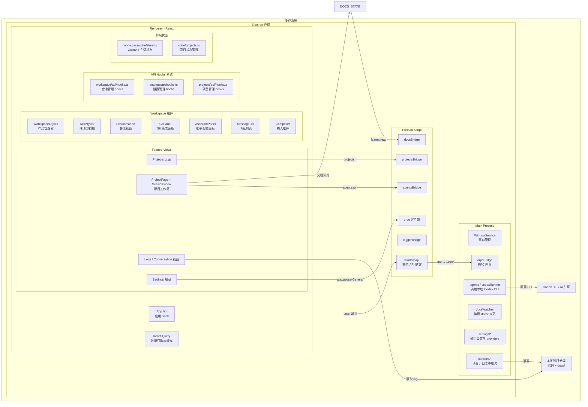
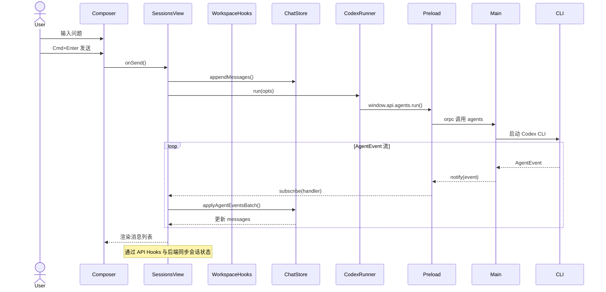

# rantcode 架构概览（草稿）

> 本文给出当前 rantcode 桌面应用的整体架构视图，并用 Mermaid 图示说明主进程 / preload / 渲染层 / agents 之间的关系，以及与本地仓库和文档驱动工作流的交互方式。

## 1. 顶层架构图

## 2. 模块职责概览

- **Main Process (`src/main/`)**
  - 负责应用生命周期管理、窗口创建（`windowService`）、单实例锁以及崩溃上报（`crashReporter`）。
  - 通过 `orpcBridge` 暴露系统、文件、项目、settings 等 RPC 能力给渲染层。
  - `agents/` + `codexRunner.ts` 封装了对本地 Codex CLI 的调用与事件流（`AgentEvent`）。
  - `docsWatcher.ts` 监控工作区的 `docs/` 目录变更，并经由 notify 通道推送到前端。

- **Preload (`src/preload/`)**
  - 初始化 orpc 客户端与通知订阅（`orpc.ts`）。
  - 创建 `agentsBridge` / `docsBridge` / `projectsBridge` / `loggerBridge`，把 main 的能力组合成高层 API。
  - 通过 `contextBridge.exposeInMainWorld` 把这些能力以 `window.api` 的形式暴露给渲染层，确保 `contextIsolation: true` 场景下仍然安全可用。

- **Renderer (`src/renderer/`)**
  - `App.tsx` 作为入口，挂载路由、全局样式、通知 (`sonner`)、React Query 等。
  - `features/projects`：项目列表视图，包含项目管理 hooks (`projects/api/hooks.ts`) 和状态管理 (`state/projects.ts`)。
  - `features/workspace`：重构后的项目工作区，内部拆分为：
    - `views/ProjectPage.tsx`：项目容器组件，提供项目级别上下文和错误处理。
    - `views/SessionsView.tsx`：核心会话与聊天功能，从原 WorkspacePage 抽取。
    - `views/WorkspaceLayout.tsx`：布局管理器，支持多视图切换（会话/助手/文档/Git/设置）。
    - `components/`：包含 `ActivityBar`、`GitPanel`、`SessionList`、`MessageList`、`Composer` 等UI组件。
    - `api/hooks.ts`：**新增 API Hooks 系统**，提供会话管理的 React Query hooks（list/create/update/delete/appendMessages）。
    - `state/store.ts`：使用 Zustand 管理 chat sessions / messages、右侧 preview 状态等。
  - `features/settings`：设置管理，包含 `api/hooks.ts` 等专门的 API hooks。
  - `features/spec`：Explorer / Diff / Work 视图，对 `docs/` 和 Git diff 做 UI 呈现。
  - `features/logs` + `conversation/`：解析 `conversation.log`，以 Session/事件流形式展示 Codex CLI 的执行记录。
  - `state/`：
    - `workspace`：提供 `WorkspaceProvider` 与 `useWorkspace`，统一 workspaceId 上下文。
    - `projects.ts`：**新增**项目状态管理，与 Projects 页面配合使用。

- **Shared (`src/shared/`)**
  - `types/webui.ts`：前后端共享的领域模型，如 `ProjectInfo` / `TaskItem` / `SpecDocMeta` / `AgentRunOptions` / `AgentEvent` 等。
  - 为 main / preload / renderer 提供统一的类型契约和 oRPC schema。

## 3. Workspace 视图内部交互

下面是 Workspace 内部从「用户输入 → Codex 执行 → UI 更新」的一次典型流程：

要点：

- **Session**（`features/workspace/types.ts`）是左侧「会话」列表中的实体，用于管理多轮对话分组；
  - 每个会话持有一个 `agentSessions` 映射（`Record<Agent, string>`），存储各 Agent 的 sessionId，支持同一会话切换不同 Agent 时保持各自上下文。
  - `useWorkspaceChat` store 负责在 workspace 维度下持久化这些会话（localStorage）。
- **API Hooks 系统**：
  - `workspace/api/hooks.ts` 提供了完整的会话管理 hooks（`useSessionsQuery`、`useCreateSessionMutation`、`useAppendMessagesMutation` 等）。
  - 这些 hooks 基于 React Query，自动处理缓存、失效策略和与后端的同步。
- **Agent 会话绑定**：
  - 当 Agent 在某次 job 期间发送 `type: 'session'` 事件时，store 会根据消息中的 `agent` 字段，将 `event.sessionId` 写入对应 Session 的 `agentSessions[agent]`；
  - 之后同一 Session 内使用该 Agent 发送新请求时，会从 `agentSessions[agent]` 读取 sessionId 作为 `AgentRunOptions` 传给 Main→Agent，使 CLI 端能够做上下文续写。
  - 这支持在同一会话中切换不同 Agent，每个 Agent 保持独立的上下文。
- **重构后的架构优势**：
  - **关注点分离**：`ProjectPage` 处理项目级上下文，`SessionsView` 处理聊天逻辑，`WorkspaceLayout` 处理布局和多视图切换。
  - **可扩展性**：通过 `ActivityBar` 可以轻松添加新的视图（如已实现的 Git 集成）。
  - **类型安全**：API Hooks 提供了完整的类型支持和自动补全。

## 4. 文档驱动与数据模型的映射

结合 `docs/design/data-model.md` 中的数据模型，本项目当前实现大致对应关系如下：

- `Project`（数据模型）
  - 对应 main 侧的项目服务 + `ProjectInfo` 类型，渲染层通过 Projects 页面管理。
  - **新增**：`state/projects.ts` 提供了项目状态管理，`projects/api/hooks.ts` 提供了 API 集成。
- `DocRef`
  - 目前主要体现在 `FsTreeNode` / `FsFile` 以及前端 `docs` store 对 docs 路径的管理。
  - 后续可以在 main 侧显式维护 DocRef 表，以支持更精细的「某一节 spec / task」级引用。
- `Session`
  - 当前 Workspace 中的 `Session` 已经通过 **API Hooks 系统** 与后端同步，部分实现了数据模型中的 Session 概念。
  - **实现状态**：本地状态管理完善，后端会话存储通过 oRPC sessions 命名空间实现。
  - 后续如需跨设备/实例持久化，可以在 main 侧增加 Session 实体存储，与 Task / DocRef 建立外键关系。
- `Job`
  - 对应 Codex CLI 的一次执行回合：在前端里是 `Message` 中的 assistant 消息（带 `jobId` 和 `status`），在 main/CLI 侧是 `AgentRunOptions.jobId` + 事件流。
- **Git 集成**（**新增实现**）
  - `GitPanel` 组件提供了完整的 Git 状态查看和 diff 功能。
  - 支持 unified/split 两种 diff 视图模式。
  - 实时监控文件变更，区分已暂存和未暂存文件。

## 5. 后续可以扩展的方向

- **Task/Session/Job 落地到主进程存储**：
  - 按 `docs/design/data-model.md` 中的结构，在 main 侧增加 Task/Session/Job 管理服务，使 Workspace 的 UI 会话与全局 Task 看板打通。

- **DocsWatcher 与 DocRef 的联动**：
  - 监控 `docs/task/`、`docs/spec/` 变更时，自动解析文档中的 frontmatter，更新 Task/DocRef 索引。

- **多模型 Provider 统一管理**：
  - `settings/vendors` + Settings 视图已经提供 Provider 配置，可以将 Codex CLI / 远程 LLM 统一抽象为 `Provider + Model`。

> 本文作为架构草稿，后续可在 `docs/design/agents-design.md` / `docs/design/workspace-store.md` 中进一步补充某些子系统的细节图与时序图。
