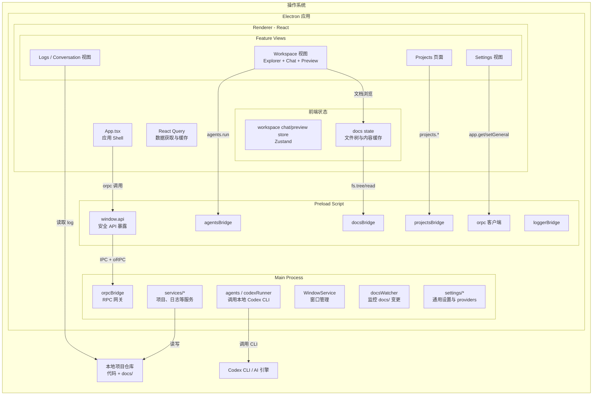
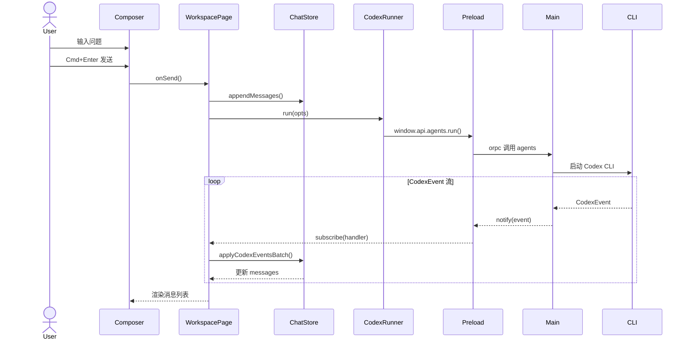

# rantcode 架构概览（草稿）

> 本文给出当前 rantcode 桌面应用的整体架构视图，并用 Mermaid 图示说明主进程 / preload / 渲染层 / agents 之间的关系，以及与本地仓库和文档驱动工作流的交互方式。

## 1. 顶层架构图

## 2. 模块职责概览

- **Main Process (`src/main/`)**
  - 负责应用生命周期管理、窗口创建（`windowService`）、单实例锁以及崩溃上报（`crashReporter`）。
  - 通过 `orpcBridge` 暴露系统、文件、项目、settings 等 RPC 能力给渲染层。
  - `agents/` + `codexRunner.ts` 封装了对本地 Codex CLI 的调用与事件流（`CodexEvent`）。
  - `docsWatcher.ts` 监控工作区的 `docs/` 目录变更，并经由 notify 通道推送到前端。

- **Preload (`src/preload/`)**
  - 初始化 orpc 客户端与通知订阅（`orpc.ts`）。
  - 创建 `agentsBridge` / `docsBridge` / `projectsBridge` / `loggerBridge`，把 main 的能力组合成高层 API。
  - 通过 `contextBridge.exposeInMainWorld` 把这些能力以 `window.api` 的形式暴露给渲染层，确保 `contextIsolation: true` 场景下仍然安全可用。

- **Renderer (`src/renderer/`)**
  - `App.tsx` 作为入口，挂载路由、全局样式、通知 (`sonner`)、React Query 等。
  - `features/projects`：项目列表视图，对应 main 侧的 Project 服务（新增/更新/删除项目）。
  - `features/workspace`：单个 Project 的工作台视图，内部又拆为：
    - `WorkspacePage`：组合 WorkspaceLayout、hooks 与 stores 的页面容器。
    - `WorkspaceLayout`：布局（左侧会话列表 + 中间 Chat + 右侧 Preview/日志）。
    - `components/SessionList` + `MessageList` + `Composer` + `RightPanel` 等 UI 组件。
  - `features/spec`：Explorer / Diff / Work 视图，对 `docs/` 和 Git diff 做 UI 呈现。
  - `features/logs` + `conversation/`：解析 `conversation.log`，以 Session/事件流形式展示 Codex CLI 的执行记录。
  - `state/`：
    - `workspace`：提供 `WorkspaceProvider` 与 `useWorkspace`，统一 workspaceId 上下文。
    - `docs`：通过 orpc.fs 维护 docs 目录的文件树与内容缓存。
    - `workspace/state/store.ts`：使用 Zustand 管理 chat sessions / messages、右侧 preview 状态等。

- **Shared (`src/shared/`)**
  - `types/webui.ts`：前后端共享的领域模型，如 `ProjectInfo` / `TaskItem` / `SpecDocMeta` / `CodexRunOptions` / `CodexEvent` 等。
  - 为 main / preload / renderer 提供统一的类型契约和 oRPC schema。

## 3. Workspace 视图内部交互

下面是 Workspace 内部从「用户输入 → Codex 执行 → UI 更新」的一次典型流程：

要点：

- **ChatSession**（`features/workspace/types.ts`）是左侧「会话」列表中的实体，用于管理多轮对话分组；
  - 每个会话可以持有一个 `codexSessionId`，和底层 Codex 的 session 绑定。
  - `useWorkspaceChat` store 负责在 workspace 维度下持久化这些会话（localStorage）。
- **Codex 会话绑定**：
  - Codex 在某次 job 期间发送 `type: 'session'` 事件时，store 会把 `event.sessionId` 记到对应 ChatSession 的 `codexSessionId` 字段；
  - 之后同一 ChatSession 内的新请求会把这个 `codexSessionId` 作为 `CodexRunOptions` 传给 Main→Codex，使 CLI 端能够做上下文续写（如果需要）。

## 4. 文档驱动与数据模型的映射

结合 `docs/design/data-model.md` 中的数据模型，本项目当前实现大致对应关系如下：

- `Project`（数据模型）
  - 对应 main 侧的项目服务 + `ProjectInfo` 类型，渲染层通过 Projects 页面管理。
- `DocRef`
  - 目前主要体现在 `FsTreeNode` / `FsFile` 以及前端 `docs` store 对 docs 路径的管理。
  - 后续可以在 main 侧显式维护 DocRef 表，以支持更精细的「某一节 spec / task」级引用。
- `Session`
  - 当前 Workspace 中的 `ChatSession` 可以视为数据模型中 Session 的一个 UI 实现版本（围绕“实现/review/补文档”等回合聚合 Codex job）。
  - 后续如需跨设备/实例持久化，可以在 main 侧增加 Session 实体存储，与 Task / DocRef 建立外键关系。
- `Job`
  - 对应 Codex CLI 的一次执行回合：在前端里是 `ChatMessage` 中的 assistant 消息（带 `jobId` 和 `status`），在 main/CLI 侧是 `CodexRunOptions.jobId` + 事件流。

## 5. 后续可以扩展的方向

- **Task/Session/Job 落地到主进程存储**：
  - 按 `docs/design/data-model.md` 中的结构，在 main 侧增加 Task/Session/Job 管理服务，使 Workspace 的 UI 会话与全局 Task 看板打通。

- **DocsWatcher 与 DocRef 的联动**：
  - 监控 `docs/task/`、`docs/spec/` 变更时，自动解析文档中的 frontmatter，更新 Task/DocRef 索引。

- **多模型 Provider 统一管理**：
  - `settings/vendors` + Settings 视图已经提供 Provider 配置，可以将 Codex CLI / 远程 LLM 统一抽象为 `Provider + Model`。

> 本文作为架构草稿，后续可在 `docs/design/agents-design.md` / `docs/design/workspace-store.md` 中进一步补充某些子系统的细节图与时序图。
